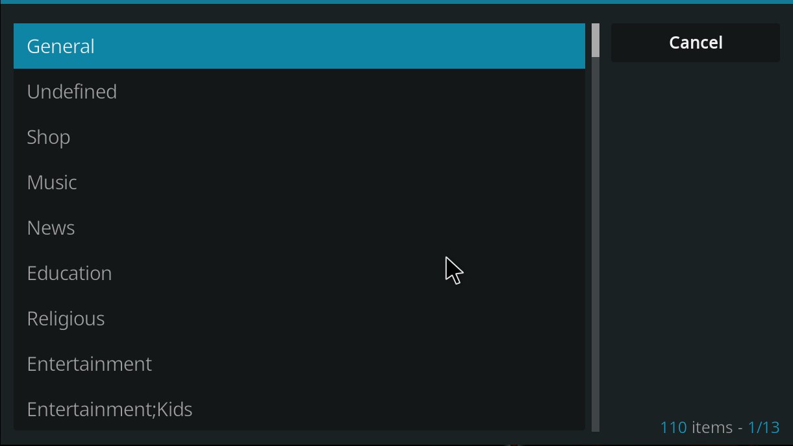

# Krypto IPTV M3U Reader + File Saver

## Overview
The Krypto M3UReader + File Saver is a Python application designed to facilitate the management of M3U playlist files commonly used in Internet Protocol Television (IPTV) services. This application offers functionalities to open, process, and manipulate M3U files, extracting crucial channel information such as name, URL, country, and group title. With a user-friendly interface built using tkinter, users can effortlessly navigate through channels, filter content based on various criteria, sort channels alphabetically, and save processed channel information to various file formats including JSON, XML, CSV, and Python.



## Features
- **File Processing:** Open one or multiple M3U files to extract channel information.
- **Channel Filtering:** Filter channels based on name, country, or group title for streamlined content management.
- **Sorting Options:** Sort channels alphabetically by name or country for easier navigation.
- **Export Capabilities:** Save processed channel information to JSON, XML, CSV, or Python files, facilitating integration with other applications and platforms.
- **Dependency Management:** The application now automatically checks for required dependencies upon startup and prompts the user to install missing packages if necessary.

## Installation
1. Clone or download the repository to your local machine.
2. Ensure you have Python 3.x installed.
3. Navigate to the project directory in your terminal.
4. Launch the application using the command:
    ```
    python KryptoM3UHelper.py
    ```


## Requirements
However... When you run my file it will download and install the pip files, if not, below is what you need to run this. Basic stuff really.. 


- Python 3.x
- tkinter (should be included in standard Python installations)
- xml.etree.ElementTree
- csv
- functools


## Usage
1. Launch the application.
2. Click on the "Open M3U File" button to select one or multiple M3U files.
3. Use the search box and filter dropdown to filter channels based on name, country, or group title.
4. Click on the "Filter" button to apply the selected filter.
5. Use the "Sort" buttons to sort channels alphabetically by name or country.
6. Click on the respective "Save to" buttons to save the processed channel information to JSON, XML, CSV, or Python files.

## Contribution
Contributions to the project are welcome! If you have any ideas for improvements or new features, feel free to open an issue or submit a pull request.

## License
This project is licensed under the MIT License. See the [LICENSE](LICENSE) file for details.
